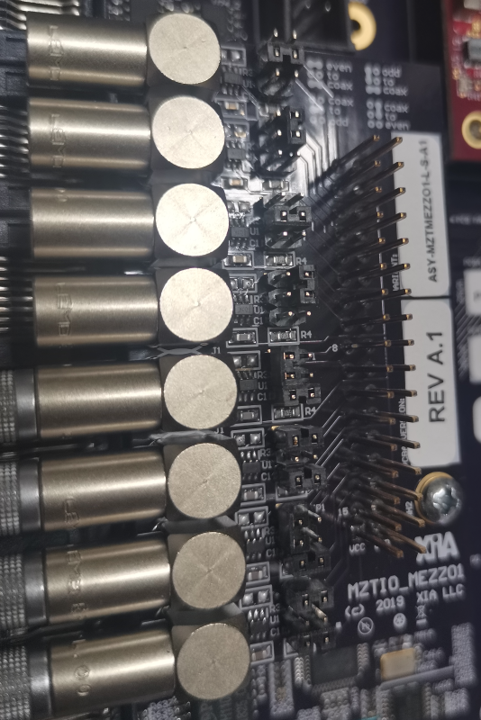

.. code.md 
.. 
.. Description: 
.. Author: Hongyi Wu(吴鸿毅)
.. Email: wuhongyi@qq.com 
.. Created: 六 6月 15 13:40:28 2019 (+0800)
.. Last-Updated: 一 12月  9 12:49:48 2019 (+0800)
..			 By: Hongyi Wu(吴鸿毅)
..	   Update #: 8
.. URL: http://wuhongyi.cn 

##################################################
Code
##################################################

============================================================
PS code
============================================================

.. code:: bash
	  
   docs   #PKU MZTIO GUIDES
   static  # css js
   webops
    
   Pixie16_MZTrigIO_Manual.pdf
    
   MZTIOCommon.c
   MZTIOCommon.h
   MZTIODefs.h
   clockprog.c
   progfippi.cc
   settings.ini
   status.c
   status.cgi
   makefile
    
   pkulogo100.jpg
   why.jpg
   webopspasswords
   index.html
   log.html
   status.html
   support.html

----

============================================================
PL code
============================================================

----------------------------------------------------------------------
downscale
----------------------------------------------------------------------

.. code:: verilog
	  
   module downscale
     (
      din,
      dout,
      down,
      clk
      );
      
      parameter DATA_W = 16;
      input [DATA_W-1:0]  down;
      input din;
      output dout;
      reg 	  dout;
      input clk;
   endmodule

----------------------------------------------------------------------
scaler
----------------------------------------------------------------------

.. code:: verilog
	  
   module scaler
     (
      din,
      dout ,
      endcount,
      clk
      );
      
      parameter DATA_W = 32;
      output[DATA_W-1:0]  dout;
      reg   [DATA_W-1:0]  dout;
      
      input din;
      input endcount;
      input clk;
   endmodule

----------------------------------------------------------------------
signaldelay512
----------------------------------------------------------------------

.. code:: verilog
	  
   module signaldelay512
     (
      din,
      dout,
      delay,
      clk
      );
    
      output dout;
      reg    dout;
      input [9:0] delay;
      input       din;
      input clk;
   endmodule

----------------------------------------------------------------------
signalextend512
----------------------------------------------------------------------

.. code:: verilog
	  
   module signalextend512
     (
      din,
      dout,
      extend,
      clk
      );
    
      input din;
      output dout;
      reg 	  dout;
      input [9:0] extend;
      input clk;
   endmodule

----------------------------------------------------------------------
IP core
----------------------------------------------------------------------

**FIFO**

.. code:: verilog
	  
   module fifo_delay512(clk, srst, din, wr_en, rd_en, dout, full, empty, 
     data_count)
   /* synthesis syn_black_box black_box_pad_pin="clk,srst,din[0:0],wr_en,rd_en,dout[0:0],full,empty,data_count[9:0]" */;
     input clk;
     input srst;
     input [0:0]din;
     input wr_en;
     input rd_en;
     output [0:0]dout;
     output full;
     output empty;
     output [9:0]data_count;
   endmodule

----

============================================================
xillydemo
============================================================

.. image:: img/MZTIO_DB.png

	   
.. code:: cpp
	  
   // The configuration of the FrontIO_A/B/C is completely flexible. For example, if you connect the RJ-45 of a Pixie-16 to FrontI/O A 0-3 (the upper RJ-45 on the trigger board), signals will connect
   // FO5 - Front I/O A 3      FrontIO_Aena==0
   // FO1 - Front I/O A 0      FrontIO_Aena==0
   // FI5 - Front I/O A 1      FrontIO_Aena==1
   // FI1 - Front I/O A 2      FrontIO_Aena==1

   // F0  5p/5n  synchronization status / multiplicity result channel 0(pku firmware)
   // FO  1p/1n  not used / multiplicity result channel 1(pku firmware) 
   // FI  5p/5n  external fast trigger
   // FI  1p/1n  external validation trigger

   // FrontIO_Aout [3] [0]  [7] [4]  [11] [8]  [15] [12]
   // FrontIO_Ain  [1] [2]  [5] [6]  [9] [10]  [13] [14]

- FRONT_X_OUTENA
	- == 1 表示从 MZ 往前面板驱动输出，代码里面操作out
	- == 0 表示从前面板往 MZ 驱动输入，代码里面操作in
- LVDS_X_OUTTENA
	- == 1 表示驱动网口向外输出
	- == 0 表示驱动网口向里输入
	
如果MEZZ01开启输入模式，则必须设置 ``FRONT_X_OUTENA==0 && LVDS_X_OUTTENA==1`` ，其余模式下，MEZZ01跳针全部设置成输出模式，此时网口可用于输入或者输出模式。
	

当前，在前面板 C 口配置 一个 MEZZ01 模块，其中前四通道设置为信号输入，分别连接[1]/[2]/[5]/[6]，后四个通道设置为信号输出，分别连接[9]/[10]/[13]/[14]。 该配置模式下，C口对应的四个网口仍然可用于多重性的输入，此时参数 FrontIO = 0x6600, LVDSIO = 0x6666。如果不使用 MEZZ01 模块，只连接网口与P16模块，则参数 FrontIO/LVDSIO 均设置为 0x6666。

.. code.md ends here 
