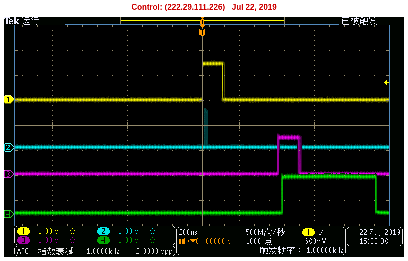

.. webgui.rst --- 
.. 
.. Description: 
.. Author: Hongyi Wu(吴鸿毅)
.. Email: wuhongyi@qq.com 
.. Created: 六 7月 20 21:12:49 2019 (+0800)
.. Last-Updated: 六 1月 18 21:23:06 2020 (+0800)
..           By: Hongyi Wu(吴鸿毅)
..     Update #: 8
.. URL: http://wuhongyi.cn 

##################################################
WEB Control GUI
##################################################

============================================================
register
============================================================

The user can easily adjust the experimental logic by modifying the control registers in the settings.ini file.

Of course, for different types of experiments, we have specialized software, please refer to the manual of the experiment for the specific register control method.

.. image:: img/settingpars.png

============================================================
web pages
============================================================

----------------------------------------------------------------------
main page
----------------------------------------------------------------------

The main page of the web, it will provide basic information and precautions for the module.

.. image:: img/MainPage.png

----------------------------------------------------------------------
control page
----------------------------------------------------------------------

The control register is used to change the experimental trigger mode, delay and stretch of logic signals, and so on.

.. image:: img/ControlPage.png

----------------------------------------------------------------------
status page
----------------------------------------------------------------------

When you aaccess the status page, the page will automatically refresh every 5 second.

There are currently five columns of monitorable parameters on this page.

- The fourth row of the first column indicates the date the solid is allowed to be used.
- The fifteenth line of the first column indicates the running time of the current round of DAQ.
- The first column, line 16, represents the percentage of DPMFULL and total runtime.

The parameters of the third column, the fourth column and the fifth column are determined by the settings of each experiment. For details, please refer to the manual of the specific experiment settings.
  
.. image:: img/StatusPage.png

	   
----------------------------------------------------------------------
log page
----------------------------------------------------------------------

In development, this page will save the status parameters and read the historical parameters.

----------------------------------------------------------------------
support page
----------------------------------------------------------------------

This page provides some basic instructions, including XIA instructions, PKU instructions, and more.

============================================================
Oscilloscope
============================================================

Output signals to the oscilloscope through the MZTIO daughter board.

Most oscilloscopes have only 4 channels, so our monitor settings are set by default for 4 channels. If you want to monitor 8 channels at the same time, you can do it with 2 oscilloscopes.

Of course, the monitored signal can be switched by modifying the control register. For instructions on how to monitor different signals, please read the instructions for the specific experiment.

The following figure is an example of oscilloscope monitoring. Line 1 represents the trigger signal, line 2 is the down scale 10, line 3 represents the signal after line 1 is delayed by 400 ns, and line 4 represents line 3 is extend to 500 ns.

	   

============================================================
FIFO IP code limits
============================================================

The figure below shows the settable range of the FIFO IP core parameters.
	   

Due to the limitation of the FIFO IP core, the delay is set to a minimum of 4 clocks.

	   
.. 
.. webgui.rst ends here
